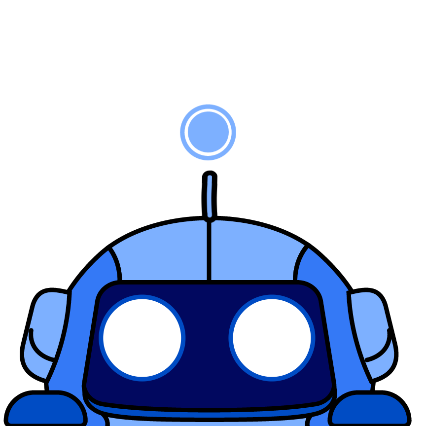

<!-- HEADER -->

   
   <h1 align="center">Incontinuity</h1>
    
Context control for LLM inference on a per-token basis

<!-- BADGES -->

   

<!-- DESCRIPTION -->
Incontinuity allows developers to modify the context prompt after each token is generated by an LLM. Instead of waiting for the entire LLM output to be generated, developers can now control the prompt and outputs at any point in the generation.

For example, instead of waiting for an LLM to generate some typed XML code, you can make a `ContextController` that will backtrack and add context to the prompt if the LLM makes a mistake in the generation. 

Think of it like using an IDE. You're writing code and you made a typo, so you go back and fix it. Oh no, you used the wrong type, so you go back and fix it. Incontinuity allows you to do the same thing with LLMs.

---

I've been working on LLM agents since the inception of LLMs and I've always wanted to have this level of control. I havent seen any packages for this, so I decided to create one. I hope you find it useful!

